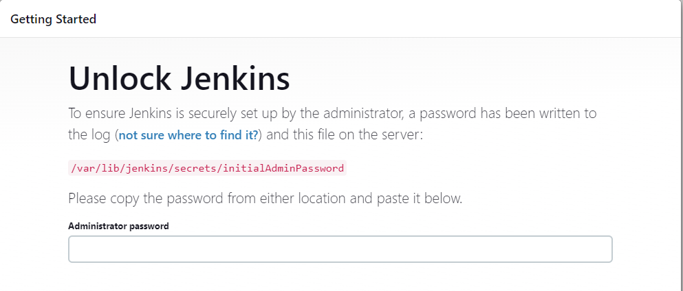
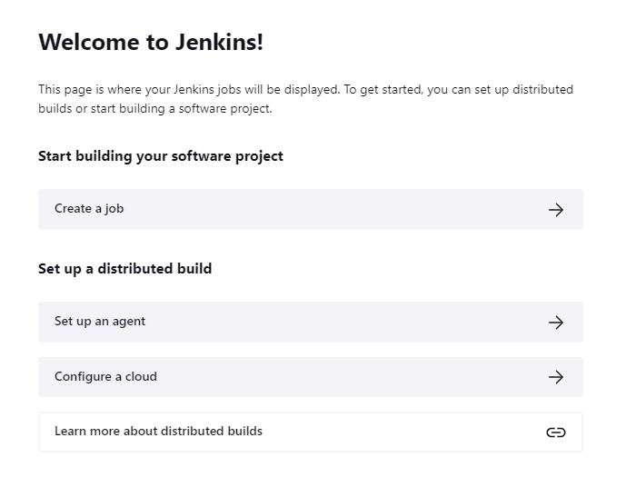

### CI/CD Jenkins Project

### How to build Jenkins?

Step 1: Log into your AWS Console and navigate to EC2 <br>
Step 2: use your own VPC, public <br>
Step 3: existing security groups <br>
step 4: launch and sign in to your GitBash terminal <br>
Step 5: Enter the commands

```
sudo apt update
sudo apt install default-jdk
java -version

wget -q -O - https://pkg.jenkins.io/debian-stable/jenkins.io.key | sudo apt-key add -

sudo sh -c 'echo deb https://pkg.jenkins.io/debian-stable binary/ > /etc/apt/sources.list.d/jenkins.list'

sudo apt update

sudo apt install jenkins
```

Navigate to your EC2 Instance 
copy and paste the IP url and add `:8080`


### How to build the environment?

Jenkins password



- navigate to git bash
`sudo cat /var/lib/jenkins/secrets/initialAdminPassword`
- This will give you the password, then enter the password
- Select `Install suggested pluggins`

jenkins url: http://52.213.84.192:8080/



### How did you rebuild the Pipeline?

Step 1: create webhook and deploy keys