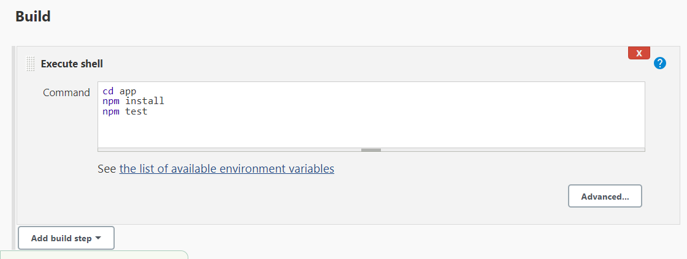

## CI/CD Jenkins Project


## How to build Jenkins?

Step 1: Log into your AWS Console and navigate to EC2 <br>

Step 2: use your own VPC, public <br>

Step 3: existing security groups <br>

step 4: launch Instance <br>

Step 5: Navigate to `Security`, `Add inbound Security groups`, then add port `8080` <br>

Step 6: sign in to your GitBash terminal <br>

Step 5: Enter the commands

```
sudo apt update
sudo apt install default-jdk
java -version

wget -q -O - https://pkg.jenkins.io/debian-stable/jenkins.io.key | sudo apt-key add -

sudo sh -c 'echo deb https://pkg.jenkins.io/debian-stable binary/ > /etc/apt/sources.list.d/jenkins.list'

sudo apt update

sudo apt install jenkins

sudo systemctl start jenkins

sudo systemctl enable jenkins
```

Navigate to your EC2 Instance 
copy and paste the IP url and add `:8080`


## How to build the environment?

After entering the URL you will be shown the following page to enter a password.


### Steps to obtain password
- navigate to GitBash <br>
- Enter the command:
```
sudo cat /var/lib/jenkins/secrets/initialAdminPassword
```
This will give you the password, then enter the password
- Select `Install suggested pluggins`


### Installing additional plugins 
- Navigate to `Manage Jenkins`
- Select `Pluggin`
- Then select `Available pluggin`
- Install `SSH Agent` `Office 365 connector` `NodeJs`

## How did you rebuild the Pipeline?


**Prerequisites:** create webhook and deploy keys

### Creating a Job for Continuous Integration (CI)

**Step 1:** log into Jenkins and click 'New Item'
- Enter a name 
- click 'Freestyle project', then okay 

**Step 2:** General 
- Enter a description
- `Discard old builds: 3`


**Step 3:** Check `GitHub project`
- Enter your repo HTTPS URL


**Step 4:** Office 365 Connector 

- Check `Restrict where this project can be run`
- Label Expression: `sparta-ubuntu-node`


**Step 5:** Source Code Management
- Check `Git`
- Enter your SSH URL for your repository
- Credentials: select your private key 

**Step 6:** Source Code Management
- Branch Specifier: `*/dev`


**Step 7:** Build Triggers
- Check: `GitHub hook trigger for GITScm polling`


**Step 8:** Build Environment 
- Check `Provide Node & npm bin/folder to PATH`


**Step 9:** Build
- Enter the following commands 

```
cd app
npm install
npm test
```



**Step 10:** Post-build Actions


### Creating a job for a dev to main merge 

**Step 1:** Create a new job `New Item`
- Add `Description`
- `Check Discard old buils: 3`
- Check `GitHub project`
- Enter your repo HTTPS URL
- Check `Restrict where this project can be run`
- Enter: `sparta-ubuntu-node`
- Check `Git`
- Add your repo SSH URL, select your private key
- Branches to build `*/dev`

**Step 2:** Select `Add Additional Behaviours`
- Then select: `Merge before build`
- Enter Name of repository: `origin`
- Branch to merge to `main`


**Step 3:** Build Triggers
- Leave all unchecked

**Step 4:** Build Environment
- Check `SSH Agent`


**Step 5:** Post-build Actions
- Select `Git Publisher`
- Check `Merge Results`
- Then press Save


**Step 6:** Navigate to GitBash terminal 
- Change main to Dev

```
git branch dev
```

**Step 7:** Make a change in your local repository
- Commit changes
- Push to GitHub
- Whilst pushing Jenkins will be triggered and allow dev to merge to main


### Creating a 3rd Job (First Iteration)

**Step 1:** Create a new job 
- Select: `New Item` and Enter Name 
- Add `Description`
- `Check Discard old buils: 3`
- Check `GitHub project`
- Enter your repo HTTPS URL
- Check `Restrict where this project can be run`
- Enter: `sparta-ubuntu-node`

**Step 2:** Source Code Management

- Check `Git`
- Add your repo SSH URL, select your private key
- Branches to build `*/main`


**Step 3:** Build Triggers


**Step 4:** Build Environment 


**Step 5:** Build
- Select `Execute shell`
- Enter the commands to run nginx, then save

```
rsync -avz -e "ssh -o StrictHostKeyChecking=no" app ubuntu@54.194.117.61:/home/ubuntu
ssh -o "StrictHostKeyChecking=no" ubuntu@54.194.117.61 <<EOF

    sudo apt-get update -y
    sudo apt-get upgrade -y
    sudo apt-get install nginx -y
    sudo systemctl restart nginx
    sudo systemctl enable nginx
EOF

```
**Step 6:** Manually `Build Now` to test if build is successful.
- If it works, add it to post build actions of the second job.

### Creating a 4th Job (Second Iteration)

**Step 1:** Create a new job 
- Select: `New Item` and Enter Name 
- Add `Description`
- `Check Discard old buils: 3`
- Check `GitHub project`
- Enter your repo HTTPS URL
- Check `Restrict where this project can be run`
- Enter: `sparta-ubuntu-node`

**Step 2:** Source Code Management

- Check `Git`
- Add your repo SSH URL, select your private key
- Branches to build `*/main`


**Step 3:** Build Triggers
- Check `Build after other projects are built`
- Projects to watch: `name of 3rd job`, `Trigger only if build is stable`
- Check `GitHub hook trigger for GITScm polling`

**Step 4:** Build Environment 
- Check `SSH-agent`
- Find your SSH KEY 


**Step 5:** Build
- Select `Execute shell`
- Enter the commands to start app, then save

```
ssh -A -o "StrictHostKeyChecking=no" ubuntu@54.194.117.61 <<EOF

# install Node.js and npm
curl -sL https://deb.nodesource.com/setup_12.x | sudo -E bash -
sudo apt install nodejs -y

# install pm2 globally
sudo npm install pm2 -g

cd app

# install project dependencies
npm install

# start the node.js application
pm2 start  app.js
pm2 restart app.js

```
**Step 6:** Manually `Build Now` to test if build is successful

**Step 7:** Navigate to your public IP address URL, then add `:3000`, your app should now be running.